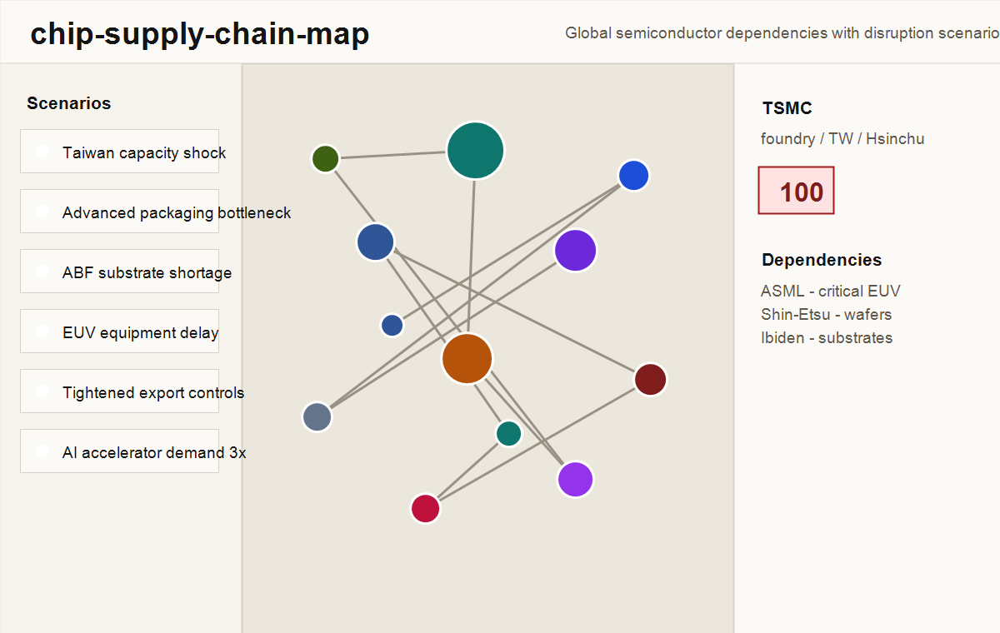
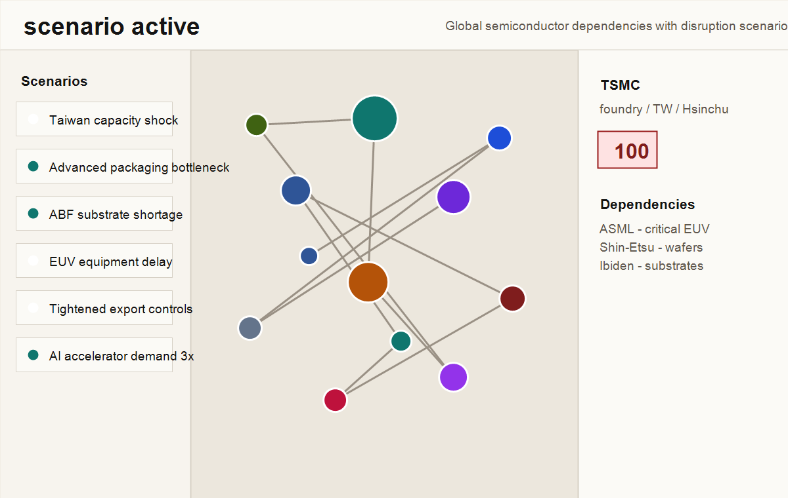

# chip-supply-chain-map

An interactive dependency graph of the global semiconductor supply
chain. Click any node - TSMC, ASML, NVIDIA, Synopsys, ASE - to see
who depends on whom and where the chokepoints concentrate.

**Live:** [chip-supply-chain-map.vercel.app](https://chip-supply-chain-map.vercel.app/)



## what you can do

- Browse 78 nodes covering foundries, fabless designers, EDA/IP,
  lithography, deposition/etch/metrology, materials, substrates,
  memory, advanced packaging, hyperscalers, and auto/industrial
  demand.
- Click a node to see dependencies, geography, lead times, the
  chokepoint score, investor sensitivity records, and the source IDs
  backing every claim.
- Toggle nine scenarios - Taiwan capacity shock, advanced packaging
  bottleneck, ABF substrate shortage, EUV equipment delay, Blackwell
  and MI supply drought, Taiwan AI cluster stress, HBM and CoWoS
  crunch, tightened export controls, and AI accelerator demand 3x.
  Multiple scenarios compose multiplicatively.



## how it works

The graph is rendered with Cytoscape.js plus the fcose layout
extension. Each node carries a chokepoint score computed as
`centrality * geographic_concentration * substitutability * lead_time * scenario_multiplier`,
then normalized onto a 0-100 display scale after each scenario
change. The score is a decision-support heuristic, not a forecast;
the four factors are documented in
[docs/methodology.md](./docs/methodology.md) and recorded as
DEC-MAP-003.

The export-controls scenario also visually suppresses
equipment-to-China edges (US, Japan, Netherlands lithography and
process equipment feeding SMIC, YMTC, and Hua Hong) by rendering
them as dashed lines at low opacity.

## for your role

If you are **curious about the semiconductor industry**: start at
the deployed graph, pick a node you have heard of (NVIDIA, TSMC,
ASML), and read its dependencies and dependents. Toggle one
scenario at a time and watch the chokepoint distribution shift.

If you are a **semiconductor or supply-chain domain expert**: the
chokepoint score is a heuristic, not a measurement. Read
[docs/methodology.md](./docs/methodology.md) for the formula, the
four factors, and what each factor approximates; read
[docs/known-limitations.md](./docs/known-limitations.md) for what
the model does not capture (capacity, inventory, customer mix,
pricing, demand elasticity).

If you are a **student or researcher**: every CSV row carries a
`source_id` that resolves to a labeled link in
[src/data/sources.md](./src/data/sources.md). The 78-node /
180-edge graph is a hand-curated 2024-2026 snapshot; copy it for a
class project or fork it to add your own scenario.

If you are an **investor or analyst**: use the Investor sensitivity
section in the node panel to connect a chokepoint or active scenario
to static revenue, capex, backlog, and exposure claims.

If you are a **builder considering Cytoscape vs react-flow vs
d3-force**: the choice is recorded with full alternatives and
rationale in
[decisions/DEC-MAP-001-cytoscape-over-react-flow-for-50-200-nodes.md](./decisions/DEC-MAP-001-cytoscape-over-react-flow-for-50-200-nodes.md).
The fcose layout choice and the four-factor heuristic carry their
own DECs in the same directory.

If you are **hiring**: this repo runs the same governance scaffold
as the rest of the portfolio - specs plus decisions plus an agent
contract plus six python gates plus a release ledger. See the
Governance section below.

## stack

React 18, Vite 5, TypeScript 5 strict, Cytoscape.js,
cytoscape-fcose, cytoscape-popper, Tailwind 3, Zustand. The
chokepoint score and the scenario reducer are written in plain
TypeScript against the GraphData type contract; the graph library
is swappable without touching the scoring layer.

## local dev

```bash
npm.cmd install
npm.cmd run dev
npm.cmd run build
```

## methodology

See [docs/methodology.md](./docs/methodology.md). The chokepoint
score is a decision-support heuristic, not a rigorous industry
model. Limitations are documented in
[docs/known-limitations.md](./docs/known-limitations.md). The
scenario design and the per-scenario multiplier choices are
documented in [docs/scenario-design.md](./docs/scenario-design.md).

## data

- `src/data/nodes.csv` - 78 companies and high-level attributes.
- `src/data/edges.csv` - 180 directional dependencies.
- `src/data/financial_sensitivity.csv` - sourced public-company
  revenue, capex, backlog, and exposure records keyed by node and
  scenario.
- `src/data/sources.md` - source IDs used by the CSV files.

Sources favor official annual reports, SEC and company pages, and
industry reports from SIA, BCG, and SEMI. Some supplier-customer
edges are public-claim heuristics where companies do not disclose
exact volumes or customer mix.

## governance

This repo runs the Cognitive Delivery Control Plane (CDCP)
operating model: spec ledger plus decisions plus dreams plus
`.agents/` plus `ops/` plus six python gate scripts.

- `specs/0001-cognitive-delivery-control-plane/` - the spec ledger
  for the CDCP install.
- `decisions/` - nine DEC files: the bootstrap `DEC-CDCP-001`,
  seven map architecture records, and `DEC-FIN-001` for the static
  financial sensitivity layer.
- `.agents/AGENTS.md` - the single contract a coding agent reads
  before acting on the repo; plus six role contracts under
  `.agents/roles/`, the tool registry at `.agents/tools.yaml`, six
  policy files under `.agents/policies/`, three state machines,
  and four workflow declarations.
- `dreams/README.md` - the weekly offline-cognition contract;
  every candidate is human-gated.
- `ops/RELEASE_LEDGER.md` and `ops/RESET_LEDGER.md` - the release
  and rollback audit trail.
- `scripts/` - python gates (`spec_check`, `voice_lint`,
  `validate_decisions`, `validate_roles`, `validate_tools`,
  `validate_policies`, data freshness, schema-cache freshness, and
  dreams validation) wired into
  `.github/workflows/gates.yml`.

The 180-day data-freshness gate (DEC-MAP-005) is wired into
`.github/workflows/stale-data.yml` and pairs with the athena-site
portfolio-manifest threshold.

## what's intentionally not built

- Real-time data feeds. Data is hand-curated CSV with source
  attestation; the 180-day freshness gate opens an issue when the
  dataset goes stale.
- Live market data or earnings projections. The investor sensitivity
  section uses static sourced company claims; it does not forecast
  EPS, valuation, or event probability.
- A complete model of the industry. Honest deferrals named in
  [docs/known-limitations.md](./docs/known-limitations.md).
- Capacity simulation. The graph carries no wafer-start, HBM-stack,
  CoWoS-line, or fab-utilization numbers; those are not public at
  this granularity for most companies.

## license

MIT for code. CC BY 4.0 for data and docs.
