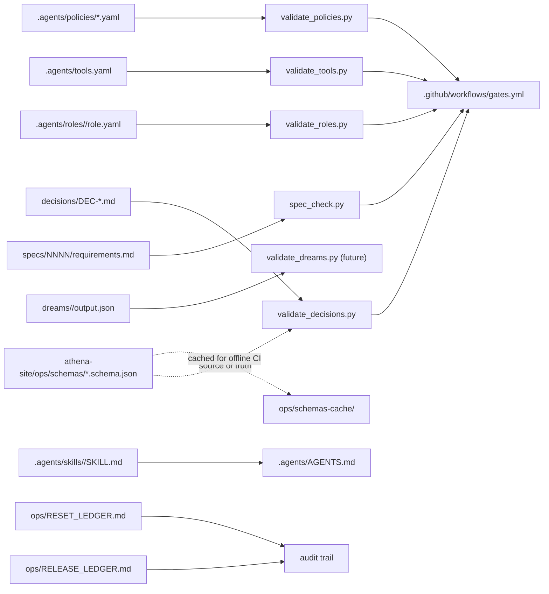

# design: cognitive-delivery-control-plane

## Shape

## Folders

### `specs/0001-cognitive-delivery-control-plane/`

The six-file ledger (`requirements`, `design`, `tasks`, `acceptance`,
`research`, `traceability`). Defines R-CDCP-001..010. This is the
first spec in the repo; later specs adopt the same shape under their
own R-* prefix (`MAP`, `GRAPH`, `DATA`, `FIN`, `UI`, `SCEN`, `OPS`).

### `decisions/`

One markdown file per architectural choice. YAML front-matter holds
the structured fields the schema requires (`id`, `spec`,
`requirement`, `date`, `status`, `reversible`); body holds the five
narrative sections (`## decision`, `## alternatives`, `## rationale`,
`## evidence`, `## rollback`). Five architectural DECs land in the
install pass: cytoscape choice, fcose layout, chokepoint heuristic,
scenario toggle design, and the 180-day data-freshness gate.

### `dreams/`

One folder per week (`dreams/YYYY-WNN/`) once the weekly dream job
ships. The folder holds a human-readable `report.md` and a structured
`output.json` matching the cross-repo `dream-output.schema.json`. The
README documents the eight modes.

### `.agents/`

The single agent contract `AGENTS.md` plus skill packages under
`skills/<id>/SKILL.md`, role contracts under `roles/<guild>.<slug>/`,
tool registry at `tools.yaml`, policy files under `policies/`, state
machines under `state-machines/`, and workflow declarations under
`workflows/`. The repo-specific `data-update.yaml` workflow fires when
`src/data/nodes.csv` or `src/data/edges.csv` changes.

### `ops/`

The two ledgers (`RELEASE_LEDGER.md`, `RESET_LEDGER.md`) plus a
`schemas-cache/` folder that mirrors the athena-site contracts so CI
runs offline, an `event-log/` folder for JSONL event streams.

## Scripts

### `scripts/voice_lint.py`

Voice-tell lint over governance copy. TARGETS scope covers
`specs/**/*.md`, `decisions/*.md`, `dreams/**/*.md`,
`.agents/AGENTS.md`, `.agents/skills/**/*.md`, and `ops/*.md`. The
legacy README and `docs/**/*.md` files predate the install; the lint
widens to cover them in a later pass after the existing WARN hits are
scrubbed or per-line allowlisted.

### `scripts/spec_check.py`

Walks every R-* defined in `specs/NNNN-*/requirements.md` and
enforces:
- six required ledger files per spec,
- R-* prefix from the allowed set (`CDCP`, `MAP`, `GRAPH`, `DATA`,
  `FIN`, `UI`, `SCEN`, `OPS`),
- traceability coverage with no phantom IDs,
- a DEC reference for every R-* or an allowlist entry (R-CDCP-*
  resolved collectively by `DEC-CDCP-001`).

### `scripts/validate_decisions.py`

Walks `decisions/DEC-*.md`, parses YAML front-matter, validates each
parsed object against `decision.schema.json` from athena-site (with a
local cache fallback under `ops/schemas-cache/`).

### `scripts/validate_roles.py`

Walks `.agents/roles/<id>/role.yaml`, validates each against
`role.schema.json`.

### `scripts/validate_tools.py`

Reads the `tools` list in `.agents/tools.yaml`, validates each entry
against `tool.schema.json`.

### `scripts/validate_policies.py`

Walks `.agents/policies/*.yaml`, validates each against
`policy.schema.json`.

## Cross-repo links

- `../athena-site/ops/control-plane.md` - the charter naming the
  contracts.
- `../athena-site/ops/schemas/decision.schema.json` - the contract for
  DEC files in this repo.
- `../athena-site/ops/schemas/role.schema.json` - the contract for
  role files.
- `../athena-site/ops/schemas/tool.schema.json` - the contract for
  the tool registry.
- `../athena-site/ops/schemas/policy.schema.json` - the contract for
  policy files.
- `../athena-site/ops/schemas/skill.schema.json` - the contract for
  SKILL.md front-matter.
- `../athena-site/ops/schemas/dream-output.schema.json` - the
  contract for future dream outputs.

## Failure modes

- A new R-* lands without a DEC: `spec_check` fails the build.
- A DEC drifts out of schema shape: `validate_decisions` fails.
- A role file drifts out of schema shape: `validate_roles` fails.
- A tool entry drifts: `validate_tools` fails.
- A policy file drifts: `validate_policies` fails.
- The cross-repo schema is unreachable in CI: each script falls back
  to its `ops/schemas-cache/*.schema.json` copy.
- A dream output proposes auto-merge: the schema's
  `human_review_required` default of `true` keeps the patch
  human-gated.
- A change to `src/data/nodes.csv` or `src/data/edges.csv` lands
  without a matching source citation in `src/data/sources.md`: the
  `data-csv-changes-require-source-citation` policy fires and routes
  the change to human review via the `data-update` workflow.
