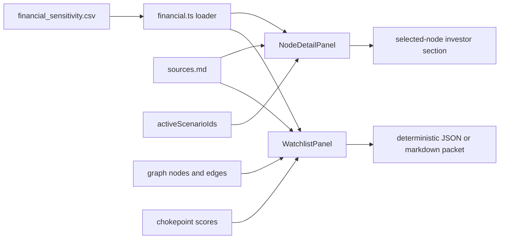
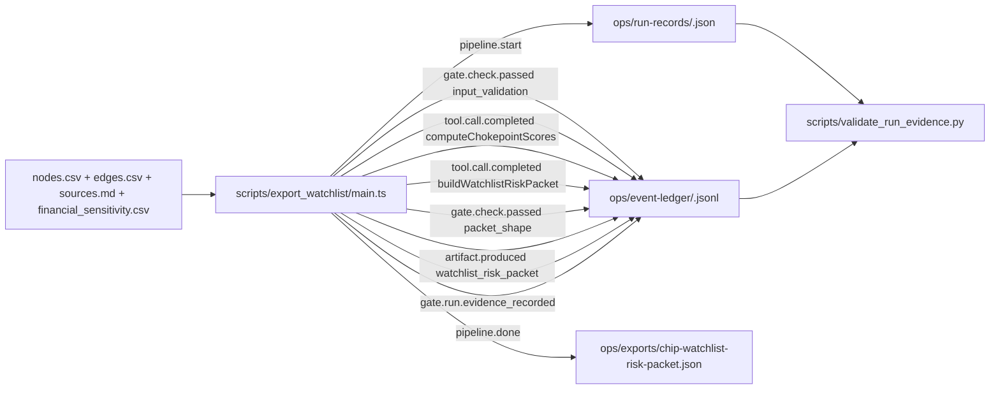

# design: earnings sensitivity overlay

## Shape



## Data

`src/data/financial_sensitivity.csv` follows the row-level source
pattern already used by `nodes.csv` and `edges.csv`. Each row points
at one public company, one graph node, and one scenario. The metric
fields stay as display strings so filings can be copied without unit
conversion loss.

## UI

The right detail panel owns the investor section. Selecting a node
filters the records to `node_id`, renders the filing metric, and
marks any record whose `scenario_id` is active. The default graph
encoding stays unchanged.

The left control rail owns the watchlist surface. A user adds graph
nodes from a select control or from the selected-node panel, removes
nodes from the watchlist, sees aggregate scores and exposure lists,
then copies or downloads the deterministic packet.

## Risk packet

`src/lib/riskPacket.ts` builds the packet from `GraphData`, the active
score map, active scenarios, financial sensitivity rows, and parsed
source references. The exporter carries source IDs through nodes,
edges, and financial rows so the packet remains a sourced graph-fact
artifact.

## Freshness

`scripts/check_data_freshness.py` includes the new CSV beside the
node, edge, and history CSV files.

## Run evidence

The watchlist export also runs as a deterministic CLI pipeline at
`scripts/export_watchlist/main.ts` (launcher at
`scripts/export_watchlist.mjs`, npm script `npm run export:watchlist`).
The CLI is the Run boundary for chip-supply-chain-map: one execution
equals one Run, with the four derivable replay-equivalence fields
populated against the cross-repo CDCP schemas.



There is no LLM in the loop. Replay equivalence is meaningful here
because the pipeline is deterministic by construction: same input
bytes plus same scoring heuristic equals same packet bytes. The Run
record's `prompt_snapshot_hash` fingerprints the heuristic config
(the closest analog to a prompt in a no-LLM data pipeline); the
`tool_schemas_snapshot_hash` fingerprints the input data (the input
data IS the tool surface here); the `sandbox_image_ref` pins the
producing commit; the `gate_results_summary` captures the
`input_validation` and `packet_shape` gate outcomes. `determinism`
and `checkpoint_ref` are omitted because the pipeline has no sampler
and no resumable checkpoint store.

## Portable repo:// URI scheme + off-by-one fix (Round 6)

Round 6 migrates the emitter onto the portable URI grammar defined
in DEC-CDCP-014 (athena-site):

```
repo://<repo-name>@<sha>/<rel-path>
artifact://<repo-name>/<artifact-id>
```

The Run record's `sandbox_image_ref` becomes
`repo://chip-supply-chain-map@<sha>/`; every `inputs[].ref` becomes
`repo://chip-supply-chain-map@<sha>/<rel-path>`; every
`outputs[].artifact_id` becomes
`artifact://chip-supply-chain-map/<id>`; `workspace_id` becomes the
bare repo name `chip-supply-chain-map`. Consumers
(`validate_run_evidence.py`, `replay_run.py`, downstream
trace-to-eval packets) resolve the URI via the new `resolve_uri`
helper; legacy local paths continue to pass through unchanged for
the migration window per DEC-CDCP-014's interop clause.

The same round fixes the systemic `sandbox_image_ref` off-by-one
bug. The emitter previously computed `git rev-parse HEAD` BEFORE
the commit that contained the sample landed; the recorded SHA was
therefore one commit BEHIND the truth. Every Round-5 sample-level
patch re-introduced the same fragility on the next regenerate.

Round 6 splits the SHA recording into two passes:

1. The emitter writes the placeholder
   `repo://chip-supply-chain-map@PENDING/` at first emit.
2. The data + Run record + ledger get committed together (the
   "regenerate commit").
3. `scripts/finalize_sandbox_ref.py` reads
   `git rev-parse HEAD` (which now points at the regenerate
   commit) and rewrites every `@PENDING/` token in the Run
   record to `@<head-sha>/`.
4. The finalizer's rewrite gets committed (the "finalize commit").

The replay command refuses to process a Run record still carrying
the PENDING placeholder; the canonical message names the finalizer.
The validator accepts PENDING (the audit trail must survive the
emit-then-finalize window).
