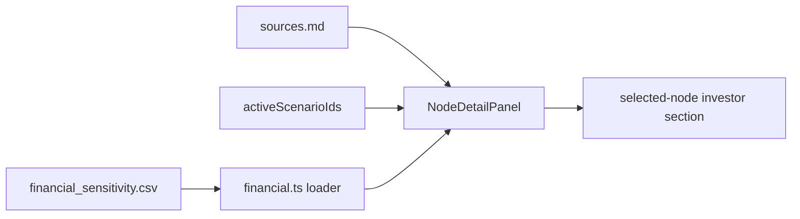

# design: earnings sensitivity overlay

## Shape

## Data

`src/data/financial_sensitivity.csv` follows the row-level source
pattern already used by `nodes.csv` and `edges.csv`. Each row points
at one public company, one graph node, and one scenario. The metric
fields stay as display strings so filings can be copied without unit
conversion loss.

## UI

The right detail panel owns the investor section. Selecting a node
filters the records to `node_id`, renders the filing metric, and
marks any record whose `scenario_id` is active. The default graph
encoding stays unchanged.

## Freshness

`scripts/check_data_freshness.py` includes the new CSV beside the
node, edge, and history CSV files.
